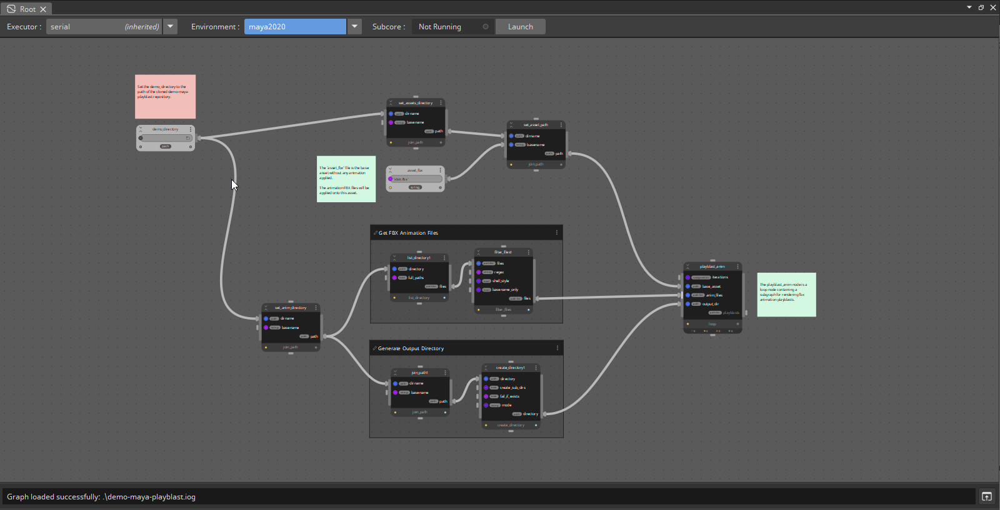
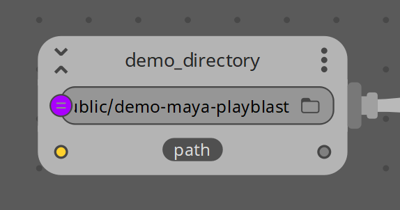

# iograft Maya Playblast Demo

This repository provides a demo graph and selection of nodes for iograft that given an FBX asset file and a directory of FBX animation files, generates playblasts for each of the animations applied to the asset.

FBX assets and FBX animations included in this repository are from Adobe Mixamo.

Some of the iograft features that this graph includes are:
- Graph Inputs to pass data into a subgraph
- Loop Node

## Running the Demo

Below are the steps to run the demo:

- Configure a Maya environment for iograft based on instructions in the iograft-maya repository (i.e. maya2020).

- Add the "nodes" directory from this repository to the "maya2020" environment's Plugin Path.


- From the command line, run the [iograft_graph_updater](https://docs.iograft.com/getting-started/iograft-commands#iograft_graph_updater) utility to set the environment of the demo graph to your maya environment:
```
iograft_graph_updater --set-environment maya2020 demo-maya-playblast.iog
```

- Launch Maya with [iograft_env](https://github.com/iograft/iograft-maya#iograft_env) or a configured [userSetup.py](https://github.com/iograft/iograft-maya#usersetuppy), load the iograft plugin and start the iograft UI.

- Open the `demo-maya-playblast.iog` file from this repository.


- Set the "demo_directory" input value to point to the cloned demo repository.


- Process the graph! Generated playblast videos will be output to the "anim/playblasts" directory of this repository.

_Note: In order to run the demo with `iograft_execute` or `iograft_ui` from the commandline without launching Maya, you will first need to either set the graph's environment to your Maya environment with the `iograft_graph_updater` tool or open the graph in Maya with the UI, and manually set the graph's environment to your Maya environment._
